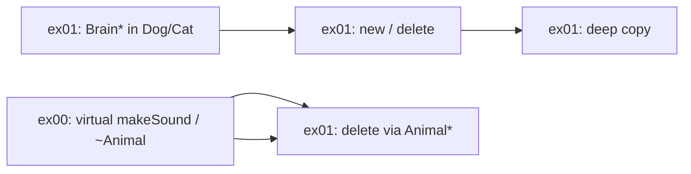

## Яку теорію пояснює ex01 (Brain)

ex00 навчив **поліморфізму** (`virtual`).
ex01 додає наступний шар: **керування пам’яттю** і **правильне копіювання** класів із вказівниками.

---

## 1. Композиція (HAS-A)

`Dog` і `Cat` **мають** `Brain`, а не **є** `Brain`:

```cpp
Brain *_brain;  // Dog HAS-A Brain
```

Це **композиція через вказівник**: `Brain` — окремий об’єкт у heap, `Dog`/`Cat` ним володіють.

---

## 2. Динамічна пам’ять (`new` / `delete`)

```cpp
_brain = new Brain();   // конструктор
delete _brain;          // деструктор
```

Суб’єкт вчить:
- коли виділяти пам’ять у конструкторі;
- коли **обов’язково** звільняти в деструкторі;
- що якщо не `delete` — буде **memory leak**.

---

## 3. Shallow copy vs Deep copy

**Shallow copy (погано):**
```cpp
// якби просто скопіювали вказівник:
_brain = other._brain;
```
Два `Dog` вказують на **один** `Brain`. Змінив один — змінився і другий. При `delete` — **double free**.

**Deep copy (правильно):**
```cpp
_brain = new Brain(*other._brain);  // новий Brain з копією даних
```
Кожен `Dog`/`Cat` має **свій** `Brain`.

Суб’єкт прямо каже: *«A copy of a Dog or a Cat mustn't be shallow»* — це головна ідея вправи.

---

## 4. Rule of Three (правило трьох)

Якщо клас керує ресурсом (тут — `Brain*` у heap), потрібні **усі три**:

| Метод | Навіщо |
|---|---|
| **Copy constructor** | `Dog tmp = basic;` |
| **Copy assignment** | `dogB = dogA;` |
| **Destructor** | `delete _brain;` |

Без них — витоки, краші, некоректні копії. Це частина **Orthodox Canonical Form** з модуля 02.

---

## 5. Зв’язок з ex00: `virtual ~Animal()`

```cpp
const Animal* j = new Dog();
delete j;  // має викликатись ~Dog(), потім ~Animal()
```

Через `virtual` деструктор:
1. `~Dog()` → `delete _brain`
2. `~Animal()`

Без `virtual ~Animal()` при `delete j` викликався б лише `~Animal()`, `_brain` не видалився б → **leak**.

---

## 6. Поліморфізм + масив `Animal*`

```cpp
Animal* array[4];
array[0] = new Dog();
array[1] = new Cat();
// ...
delete array[i];  // delete as Animal*
```

Тут поєднуються дві ідеї:
- **поліморфізм** — масив базового типу, об’єкти різних класів;
- **virtual destructor** — коректне знищення `Dog`/`Cat` через `Animal*`.

---

## 7. Порядок виклику конструкторів/деструкторів

**Створення `Dog`:**
```
Animal constructor → Dog constructor → Brain constructor
```

**Знищення `Dog`:**
```
Dog destructor (delete Brain) → Animal destructor
```

Суб’єкт каже перевірити *«expected order»* — це **constructor/destructor chaining** при успадкуванні.

---

## 8. Brain як окремий клас (OCF)

`Brain` теж у **Orthodox Canonical Form**:
- default constructor
- copy constructor
- copy assignment
- destructor

Щоб deep copy `Dog` міг коректно копіювати `_ideas[100]`.

---

## Карта: ex00 → ex01



---

## Коротко одним реченням

**ex01 вчить: коли в класі є вказівник на динамічну пам’ять, копіювання і знищення треба робити правильно (deep copy + Rule of Three), а з поліморфізмом це працює лише з `virtual` деструктором.**

---

**Примітка:** у твоєму `main.cpp` для ex01 ще немає тесту з **масивом `Animal*`** (половина Dog, половина Cat) — це окремо вимагає суб’єкт. Якщо хочеш, щоб я дописала — перемкни на Agent mode.
Додала два тести в [main.cpp](solutions/C++04/ex01/main.cpp):

**Test 5** — мінімальний приклад з суб’єкту:
```cpp
const Animal *subjDog = new Dog();
const Animal *subjCat = new Cat();
delete subjDog;  // ~Dog → ~Animal
delete subjCat;  // ~Cat → ~Animal
```

**Test 6** — масив `Animal*` (6 об’єктів: 3 Dog + 3 Cat):
```cpp
Animal *zoo[6];
// наповнення, makeSound(), потім delete zoo[n] для кожного
```

При `delete` через `Animal*` викликаються правильні деструктори (`~Dog`/`~Cat` → `~Animal`), без витоків `Brain`. Збірка проходить успішно.

## `other` — що це?

**`other`** — просто **ім’я параметра**. Означає «інший об’єкт того ж класу, з якого копіюємо».

```cpp
Dog &Dog::operator=(Dog const &other) {
    // other — це dogA, коли пишемо: dogB = dogA;
}
```

| Код | Хто такий `other` |
|---|---|
| `dogB = dogA;` | `other` → `dogA` |
| `cat2 = cat1;` | `other` → `cat1` |

`const` означає: через `other` не можна змінити оригінал, лише читати.

---

## `this` — що це?

**`this`** — вказівник на **поточний об’єкт** (той, для якого викликана функція).

```cpp
dogB = dogA;
// this → адреса dogB
// other → dogA
```

---

## `*this` — що це?

**`*this`** — **розіменування**: отримуємо сам об’єкт, а не вказівник на нього.

```cpp
return *this;  // повертає посилання на dogB
```

У `operator=` функція має повернути `Dog&`, тому пишуть:

```cpp
Dog &Dog::operator=(Dog const &other) {
    if (this != &other) {
        // копіювання...
    }
    return *this;   // повертаємо dogB
}
```

---

## Навіщо `if (this != &other)`?

| Вираз | Значення |
|---|---|
| `this` | адреса **лівого** об’єкта (`dogB`) |
| `&other` | адреса **правого** об’єкта (`dogA`) |

Перевірка захищає від **самоприсвоєння**:

```cpp
dogA = dogA;  // this і &other — одна адреса → копіювати не треба
```

Без перевірки можна було б видалити `_brain` і втратити дані.

---

## Навіщо `return *this`?

Щоб працювали **ланцюжки**:

```cpp
dogC = dogB = dogA;
//       ↑ спочатку dogB = dogA, повертає dogB
//  ↑ потім dogC = (результат)
```

---

## Міні-приклад

```cpp
Dog dogA;
Dog dogB;

dogB = dogA;
```

1. Викликається `operator=` для `dogB`
2. `this` → адреса `dogB`
3. `other` → `dogA`
4. `this != &other` → true → робимо deep copy
5. `return *this` → повертаємо `dogB`

---

## Коротко

| | |
|---|---|
| **`other`** | об’єкт, **з** якого копіюємо |
| **`this`** | вказівник на об’єкт, **якому** присвоюємо |
| **`*this`** | сам цей об’єкт (для `return`) |
