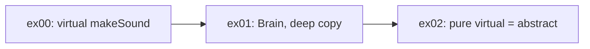

## Що тут вчать (ex02)

Суб’єкт каже: **створювати `Animal` напряму — не має сенсу**, бо він «ніяк не звучить». Тому його роблять **абстрактним класом** — класом, який **не можна інстанціювати** (створити об’єкт напряму).

---

## Головна ідея: Abstract class (абстрактний клас)

**Абстрактний клас** — це «шаблон» / база для інших класів (`Dog`, `Cat`), але **не повноцінний сам по собі**.

```cpp
Animal a;        // ❌ має бути заборонено
Dog d;           // ✅ OK
Cat c;           // ✅ OK
Animal* p = new Dog();  // ✅ OK — вказівник на базовий клас
```

`Animal` описує **загальну ідею** «тварини», але конкретний звук є лише у `Dog` і `Cat`.

---

## Як це зробити в C++: pure virtual

`makeSound()` роблять **чисто віртуальною** (= 0):

```cpp
virtual void makeSound() const = 0;  // pure virtual
```

| Тип функції | Можна створити об’єкт? |
|---|---|
| `virtual void makeSound()` | Так — `Animal` звичайний клас |
| `virtual void makeSound() = 0` | **Ні** — `Animal` абстрактний |

Якщо хоч одна функція `= 0`, клас **абстрактний** і `Animal a;` дасть помилку компіляції.

---

## Навіщо перейменувати в `AAnimal`?

Префікс **`A`** = **Abstract** — поширена домовленість у 42:

```cpp
class AAnimal { ... };  // абстрактний
class Dog : public AAnimal { ... };
class Cat : public AAnimal { ... };
```

Не обов’язково, але показує: «цей клас не для прямого створення».

---

## Що зміниться, а що — ні

**Зміниться:**
```cpp
Animal meta;              // ❌ compile error
new Animal();             // ❌ compile error
```

**Залишиться як раніше:**
```cpp
AAnimal* j = new Dog();   // ✅
j->makeSound();           // ✅ Woof
delete j;                 // ✅ virtual destructor
Dog d;                    // ✅ deep copy Brain з ex01
```

---

## Зв’язок з попередніми вправами



| Вправа | Теорія |
|---|---|
| **ex00** | `virtual` — правильний звук через `Animal*` |
| **ex01** | `Brain*`, deep copy, Rule of Three |
| **ex02** | **Abstract class** — базовий клас не створюється напряму |

---

## Що треба змінити в коді (орієнтир)

1. **`makeSound() = 0`** у `Animal` / `AAnimal`
2. **`Dog` і `Cat`** — **обов’язково** реалізують `makeSound()` (інакше теж абстрактні)
3. Прибрати з `main` усі `new Animal()` і `Animal` на стеку
4. Залишити `virtual ~Animal()` — все ще потрібен для `delete` через вказівник

---

## Коротко

**Ex02 вчить:** не всі класи мають стати об’єктами — деякі існують лише як **база для успадкування**. **Pure virtual** (`= 0`) робить клас **абстрактним** і захищає від помилок на кшталт «створив Animal, а він нічого не робить».

---

*(Твоє «oj nen vtyt yfdxbnb yfvfuf.nmcz» — це «що тут мене учать проекту» з англійської розкладки клавіатури.)*

Якщо хочеш, щоб я реалізувала `AAnimal` у `ex02` — перемкни на **Agent mode**.
